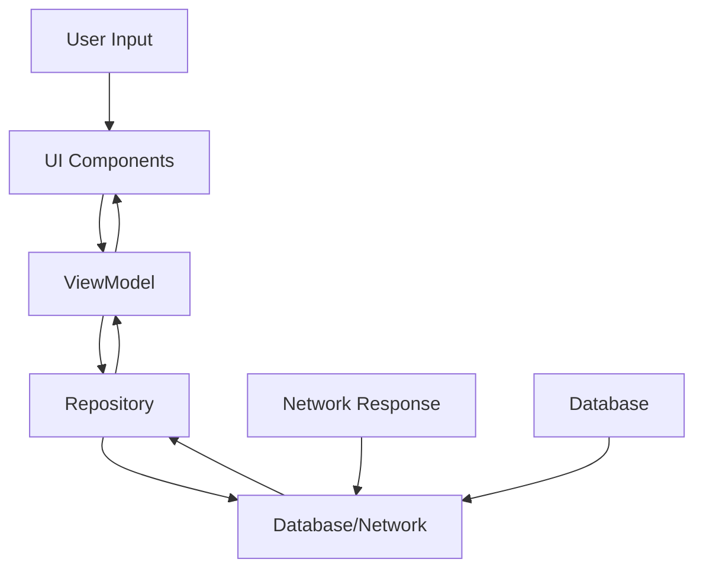

# LearnStep Desktop 软件架构文档

## 概述

LearnStep Desktop 是一个基于 Kotlin Compose Multiplatform 构建的 AI 聊天桌面应用程序。本文档描述了项目经过重构后的架构设计，旨在实现高内聚、低耦合的模块化架构。

## 架构原则

### 1. 高内聚低耦合
- 每个模块内部功能紧密相关
- 模块之间依赖关系简单明确
- 职责分离清晰

### 2. 单一职责原则
- 每个类和函数都有明确的单一职责
- 避免"上帝类"和过大的函数

### 3. 依赖倒置原则
- 高层模块不依赖低层模块，都依赖于抽象
- 通过接口和抽象类降低耦合

## 目录结构

```
src/jvmMain/kotlin/ai/learnstep/desktop/
├── data/                          # 数据层
│   ├── model/                     # 数据模型
│   │   ├── Chat.kt               # 聊天会话模型
│   │   └── Message.kt            # 消息模型
│   ├── repository/               # 数据访问层
│   │   ├── ChatRepository.kt     # 聊天数据仓库
│   │   ├── MessageRepository.kt  # 消息数据仓库
│   │   └── SettingsRepository.kt # 设置数据仓库
│   └── database/                 # 数据库管理
│       ├── DatabaseProvider.kt   # 数据库连接提供者
│       └── DatabaseMigrations.kt # 数据库迁移管理
├── net/                          # 网络层
│   ├── OpenRouterClient.kt       # OpenRouter API 客户端
│   └── model/                    # 网络数据模型
│       ├── ChatMessage.kt        # 聊天消息网络模型
│       └── ModelInfo.kt          # AI 模型信息
├── ui/                           # 用户界面层
│   ├── components/               # 可复用UI组件
│   │   ├── NavigationSidebar.kt  # 导航侧边栏
│   │   ├── AssistantListPanel.kt # 助手列表面板
│   │   ├── ChatHeader.kt         # 聊天头部组件
│   │   ├── ChatContent.kt        # 聊天内容组件
│   │   ├── ChatMessage.kt        # 单个消息组件
│   │   └── ChatInputArea.kt      # 输入区域组件
│   ├── screens/                  # 页面级组件
│   │   ├── ChatScreen.kt         # 聊天页面
│   │   └── SettingsScreen.kt     # 设置页面
│   ├── AppScaffold.kt            # 主应用框架
│   └── Theme.kt                  # 主题样式
├── viewmodel/                    # 业务逻辑层
│   └── ChatViewModel.kt          # 聊天业务逻辑
├── App.kt                        # 应用入口组件
└── main.kt                       # 主函数入口
```

## 架构分层

### 1. 数据层 (Data Layer)

#### 数据模型 (Model)
- **Chat**: 聊天会话的数据结构
- **Message**: 单条消息的数据结构
- 遵循数据类的不可变性原则

#### 数据仓库 (Repository)
- **ChatRepository**: 管理聊天会话的CRUD操作
- **MessageRepository**: 管理消息的数据操作
- **SettingsRepository**: 管理应用设置的持久化

#### 数据库管理 (Database)
- **DatabaseProvider**: 单例模式管理数据库连接
- **DatabaseMigrations**: 集中管理数据库表结构和迁移

```kotlin
// 数据层示例
data class Chat(
    val id: Long,
    val title: String,
    val createdAt: Long,
)

class ChatRepository {
    fun createChat(title: String): Chat
    fun listChats(): List<Chat>
}
```

### 2. 网络层 (Network Layer)

#### API 客户端
- **OpenRouterClient**: 封装与 OpenRouter API 的交互
- 统一的错误处理和响应解析
- 支持模型列表获取和聊天补全

#### 网络模型
- **ChatMessage**: 网络传输的消息格式
- **ModelInfo**: AI 模型信息结构

```kotlin
// 网络层示例
class OpenRouterClient(private val apiKeyProvider: () -> String?) {
    fun listModels(): Result<List<ModelInfo>>
    fun chatCompletion(model: String, messages: List<ChatMessage>): Result<String>
}
```

### 3. 业务逻辑层 (Business Logic Layer)

#### ViewModel
- **ChatViewModel**: 管理聊天相关的所有业务逻辑
- 使用 Compose 的状态管理
- 协程处理异步操作
- 统一的错误处理机制

```kotlin
// 业务逻辑层示例
class ChatViewModel {
    // 状态管理
    var messages by mutableStateOf<List<Message>>(emptyList())
    var loading by mutableStateOf(false)

    // 业务方法
    fun send()
    fun createChatAndSelect(title: String = "New Chat")
    fun selectChat(chatId: Long)
}
```

### 4. 用户界面层 (UI Layer)

#### 可复用组件 (Components)
每个组件都有明确的职责和接口：

- **NavigationSidebar**: 应用导航
- **AssistantListPanel**: 助手选择面板
- **ChatHeader**: 聊天会话头部
- **ChatContent**: 消息列表显示
- **ChatMessage**: 单条消息渲染
- **ChatInputArea**: 消息输入区域

#### 页面组件 (Screens)
- **ChatScreen**: 聊天主界面
- **SettingsScreen**: 设置界面

```kotlin
// UI层示例
@Composable
fun ChatScreen(
    messages: List<Pair<String, String>>,
    input: String,
    onInput: (String) -> Unit,
    onSend: () -> Unit,
    loading: Boolean,
    selectedModel: String,
    modifier: Modifier = Modifier,
)
```

## 设计模式应用

### 1. Repository 模式
- 抽象数据访问逻辑
- 统一数据操作接口
- 便于测试和mock

### 2. 单例模式
- DatabaseProvider 确保数据库连接的唯一性
- 资源管理优化

### 3. 组合模式
- UI组件的层次化组织
- 可复用的组件设计

### 4. 观察者模式
- Compose 的状态订阅机制
- 响应式UI更新

## 数据流



1. **用户输入** → UI组件 → ViewModel
2. **业务逻辑** → Repository → 数据源（Database/Network）
3. **数据响应** → Repository → ViewModel → UI更新

## 错误处理策略

### 1. 统一错误处理
- 使用 Kotlin 的 Result 类型
- 在 ViewModel 层统一处理错误
- UI层显示用户友好的错误信息

### 2. 网络错误处理
- 连接超时重试机制
- API错误码统一处理
- 网络状态监控

### 3. 数据库错误处理
- 事务回滚机制
- 数据完整性检查
- 迁移失败恢复

## 性能优化策略

### 1. UI性能
- 使用 LazyColumn 处理大量消息
- 适当的状态提升避免不必要的重组
- 图片懒加载和缓存

### 2. 数据库性能
- 适当的索引设计
- 分页查询大量数据
- 连接池管理

### 3. 网络性能
- HTTP连接复用
- 请求去重和缓存
- 数据压缩

## 测试策略

### 1. 单元测试
- Repository 层的数据操作测试
- ViewModel 业务逻辑测试
- 网络客户端的mock测试

### 2. 集成测试
- 数据库操作集成测试
- API调用集成测试

### 3. UI测试
- Compose UI 测试框架
- 用户交互流程测试

## 扩展指南

### 1. 添加新功能
1. 在对应的层级创建新的类/组件
2. 遵循现有的命名约定和架构模式
3. 更新相关的接口和数据模型
4. 添加相应的测试用例

### 2. 添加新的数据源
1. 在 `data/repository` 创建新的Repository
2. 定义相应的数据模型
3. 在ViewModel中集成新的数据源
4. 更新UI组件以显示新数据

### 3. 添加新的UI组件
1. 在 `ui/components` 创建可复用组件
2. 在 `ui/screens` 创建页面级组件
3. 遵循Compose的设计原则
4. 保持组件的单一职责

## 依赖管理

### 1. 核心依赖
- Kotlin Coroutines: 异步编程
- Compose Multiplatform: UI框架
- SQLite JDBC: 数据库驱动
- OkHttp: 网络请求
- JSON处理: API数据解析

### 2. 依赖注入
目前使用构造函数注入，未来可考虑引入：
- Koin: 轻量级依赖注入框架
- Dagger/Hilt: 编译时依赖注入

## 最佳实践

### 1. 代码规范
- 遵循 Kotlin 官方编码规范
- 使用有意义的命名
- 适当的注释和文档
- 保持函数简洁（建议不超过20行）

### 2. 状态管理
- 使用不可变数据结构
- 状态提升到适当的层级
- 避免在Composable中直接操作状态

### 3. 资源管理
- 及时释放网络连接
- 合理管理数据库连接
- 内存泄漏检测和预防

## 安全考虑

### 1. 数据安全
- API密钥安全存储
- 敏感数据加密
- 输入验证和清理

### 2. 网络安全
- HTTPS强制使用
- 证书验证
- 请求签名验证

## 未来规划

### 1. 短期目标
- 完善单元测试覆盖率
- 添加国际化支持
- 优化UI响应性能

### 2. 中期目标
- 支持插件系统
- 添加更多AI模型提供商
- 实现本地模型支持

### 3. 长期目标
- 多平台支持（Android、iOS）
- 云同步功能
- 团队协作功能

## 贡献指南

### 1. 代码提交
- 遵循现有的架构模式
- 提供完整的测试用例
- 更新相关文档

### 2. 架构变更
- 讨论重大架构变更
- 保持向后兼容性
- 提供迁移指南

---

**最后更新**: 2025年9月1日
**版本**: 1.0
**维护者**: LearnStepAI Team
